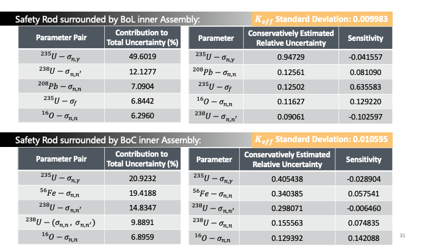

# DLFR_SU

Sensitivity and Uncertainty (SU) Analysis for Demonstration of the Lead-cooled Fast Reactor (DLFR)

## Folder Structure
DLFR Modeling and Sensitivity/Uncertainty Analysis
- Assembly and core models are in directory "model/"
- Sensitivity and uncertainty analysis code is in directory "SU_analysis/"

## Snapshots

### Reactor Model

|  |  |
| :----------------------------------: | :----------------------------------: |
|      |     |

### Sensitivity and Uncertainty (SU) Analysis

|  |  |
| :-----------------------------------: | :-----------------------------------: |
|      |      |

### Implementation

|  |  |
| :-----------------------------------: | :-----------------------------------: |
|          Calculation stream           |          Code implementation          |

### Results

|  |  |
| :-----------------------------------: | :-----------------------------------: |
|      |      |

## Presentation Slides

